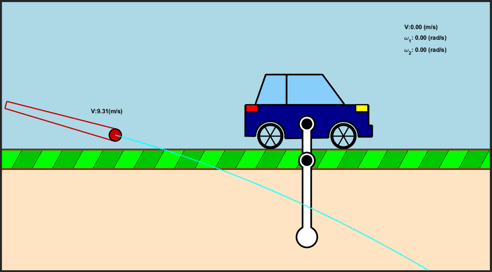

# PendulumLab

  

  An interactive physics simulation environment exploring pendulum dynamics, projectile motion, and real-time visualization.

# About
Originally developed as part of a **Dynamics course project during my third semester in 2023**, the assignment was initially focused on modeling a simple pendulum system. I expanded the scope by developing a more complex **double pendulum simulation**, introducing additional dynamic interactions and a more challenging mathematical model.

The project was extended into a complete interactive physics simulation featuring custom rendering, user-controlled launching mechanics, adjustable initial conditions, and real-time visualization of the system behavior. The additional complexity and level of implementation were recognized through the project receiving extra marks as one of the strongest submissions in the course.

## Features

- Double pendulum physics simulation
- Interactive projectile launching system
- Real-time parameter adjustment
- Custom graphics rendering without external assets
- User-controlled initial conditions
- Physics-based collision handling
- Mathematical modeling of dynamic systems

> [!TIP]
> Interactive demos and simulation recordings are available in the `demos/` folder.  
> One example is shown below to demonstrate the implemented mechanics and system behavior.

## Demo Preview

https://github.com/user-attachments/assets/5b48c7c8-69b0-442c-84fa-7cb54787f55d
